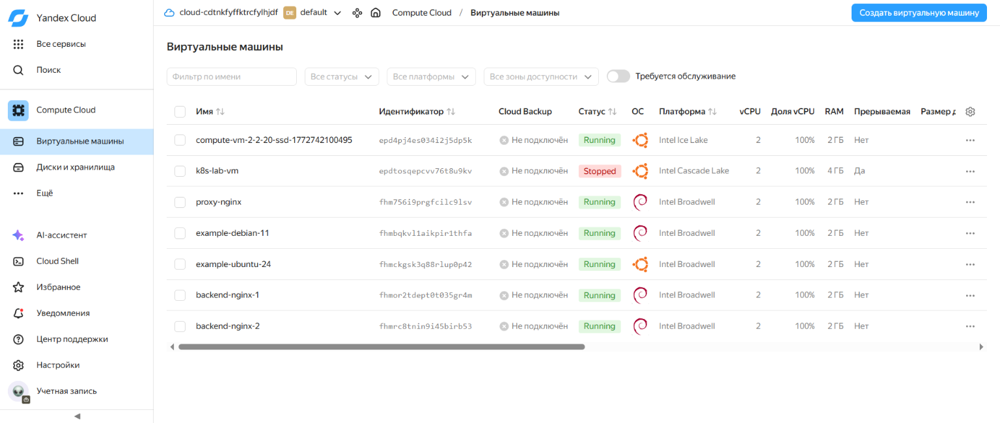
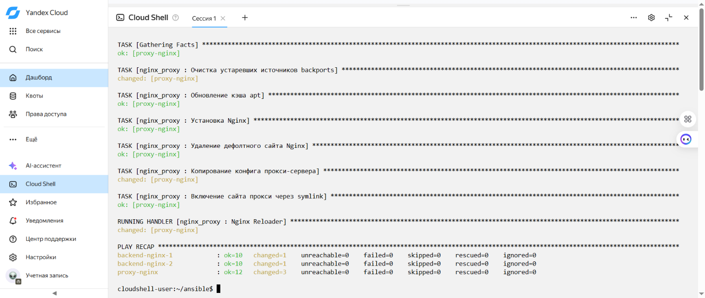

# Sysadmin Final Project — Yandex Cloud + Terraform + Ansible

## Структура проекта

```
sysadmin_repo/
├── Terraform/          # Манифесты для развёртывания 3 ВМ в Yandex Cloud
│   ├── main.tf
│   ├── variables.tf
│   └── outputs.tf
└── Ansible/            # Playbook и роли для настройки машин
    ├── inventory.ini
    ├── site.yml
    └── roles/
        ├── common/
        ├── proxy_nginx/
        └── backend_nginx/
```

## Роли Ansible

- **common** — устанавливает hostname и стандартные пакеты (net-tools, dnsutils, wget, curl, mc, rsync)
- - **proxy_nginx** — проксирующий Nginx: перенаправляет запросы с порта 3000 на порт 80 backend-машины
  - - **backend_nginx** — отдающий Nginx: страница "Hello from `<hostname>`!" с именем машины и группой (Magic Variables)
   
    - ## Использование
   
    - ```bash
      # Terraform
      cd Terraform && terraform init && terraform apply

      # Ansible
      cd Ansible && ansible-playbook -i inventory.ini site.yml
      ```

      ## Ключевые файлы конфигурации

      ### Ansible/inventory.ini

      ```ini
      [proxy]
      proxy-nginx ansible_host=89.169.XXX.XXX ansible_user=debian ansible_ssh_private_key_file=~/.ssh/id_ed25519

      [backend]
      backend-nginx-1 ansible_host=89.169.YYY.YYY ansible_user=debian ansible_ssh_private_key_file=~/.ssh/id_ed25519
      backend-nginx-2 ansible_host=89.169.ZZZ.ZZZ ansible_user=debian ansible_ssh_private_key_file=~/.ssh/id_ed25519
      ```

      ### Ansible/site.yml

      ```yaml
      ---
      - name: Configure all VMs
        hosts: all
        become: true
        roles:
          - common

      - name: Configure proxy Nginx
        hosts: proxy
        become: true
        roles:
          - proxy_nginx

      - name: Configure backend Nginx
        hosts: backend
        become: true
        roles:
          - backend_nginx
      ```

      ### Ansible/roles/proxy_nginx/templates/proxy.conf.j2

      ```nginx
      server {
          listen 3000;
          location / {
              proxy_pass http://{{ hostvars[groups["backend"][0]]["ansible_host"] }}:80;
              proxy_set_header Host $host;
              proxy_set_header X-Real-IP $remote_addr;
              proxy_set_header X-Forwarded-For $proxy_add_x_forwarded_for;
          }
      }
      ```

      ## Отчёт

      ### Скриншот 1 — Список виртуальных машин в Yandex Cloud

      Три ВМ развёрнуты через Terraform и находятся в статусе **Running**:
      - `proxy-nginx` — проксирующий сервер
      - - `backend-nginx-1` — backend-сервер 1
        - - `backend-nginx-2` — backend-сервер 2
         
          - 
         
          - ### Скриншот 2 — Выполнение Ansible playbook
         
          - Ansible playbook выполнен успешно. Все три роли (common, proxy_nginx, backend_nginx) применены ко всем машинам без ошибок.
         
          - 
         
          - ### Скриншот 3 — Страница http://&lt;IP proxy-nginx&gt;:3000
         
          - Страница отображает: заголовок **"Hello from backend-nginx-1!"** и строку **"Group: backend"** — имя машины и группа получены через Magic Variables Ansible (`inventory_hostname` и `group_names[0]`). Proxy-nginx на порту 3000 успешно перенаправляет запросы на порт 80 backend-nginx-1.
         
          - 
         
          - ## Ссылка на репозиторий
         
          - https://github.com/alexander12102005-source/sysadmin_repo
         
          - ## Проверка
         
          - Открыть в браузере: `http://<IP proxy-nginx>:3000`
         
          - Пример: http://46.21.247.106:3000 — отображает "Hello from backend-nginx-1!"
